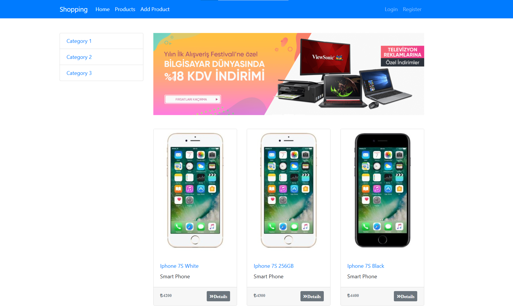
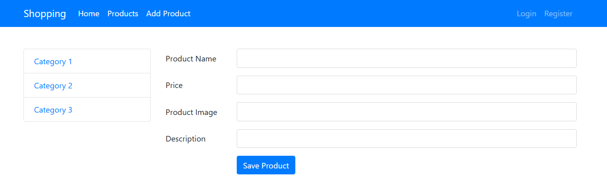

# Shopping Website with Template Engine

Shopping Website project is a web application built with JavaScript using Express.js and Node.js. It is a e-commerce website structure that allows users to browse and purchase products. 

## Overview

The project uses MVC architecture and includes features such as Template Engine Pug for dynamic content generation, template rendering, RESTful API and server HTTP request handling. This project showcases techniques for creating and serving dynamic content using Node.js, including templating, data binding, and server-side rendering.





## Features

- Dynamic HTML content generation
- Template Engine rendering with Pug
- Server HTTP request handling with Express.js
- Content manipulation with simple database

## Requirements

- Node.js
- Npm
- Express.js
- Pug
- Body Parser

## Installation

You can install dependencies manually with npm:
```bash
npm install express
npm install body-parser
npm install pug
```

Npm Auto installation from **package.json**:
```bash
npm install
```

## Usage

You can start the server with:
```bash
node app.js
```

Also, you can run npm script:
```bash
npm start
```

Now, you can open [http://localhost:3000](http://localhost:3000) in your browser.

> Server listening ... at http://localhost:3000

## Project Structure

```
shopping-website-nodejs/
|─── assets/
|─── public/
|     |─── css/
|     |─── img/
|─── views/
|     |─── includes/
|     |─── layouts/
|     |─── mixins/
|     |─── index.pug
|     |─── add-product.pug
|     |─── 404.pug
|─── routes/
|     |─── admin.js
|     |─── user.js
|     |─── data.js
|─── app.js
|─── package.json
└─── README.md
```
